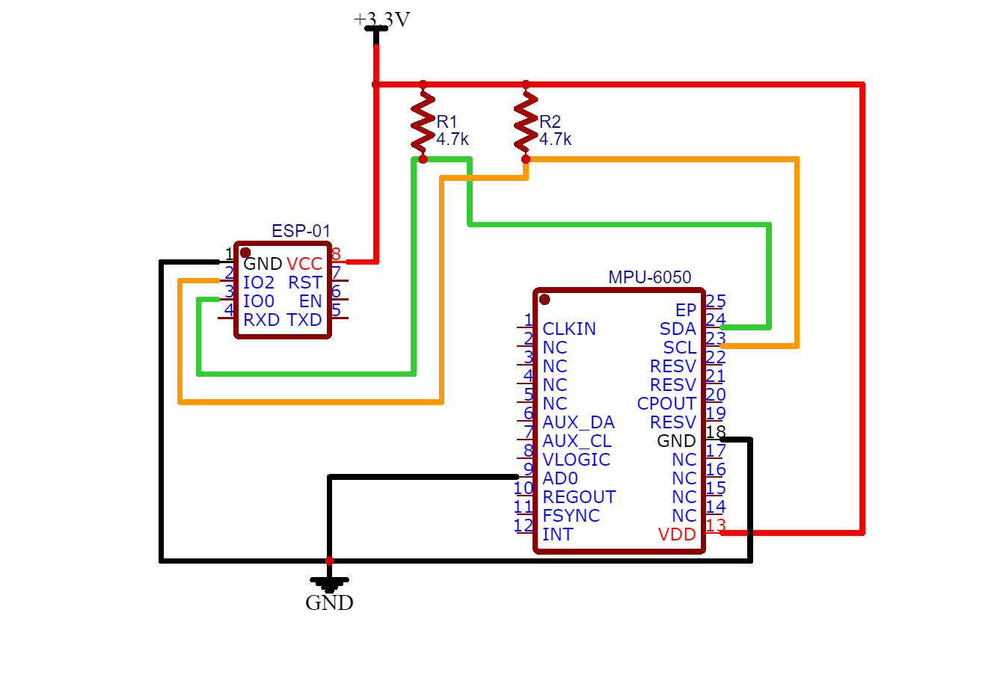
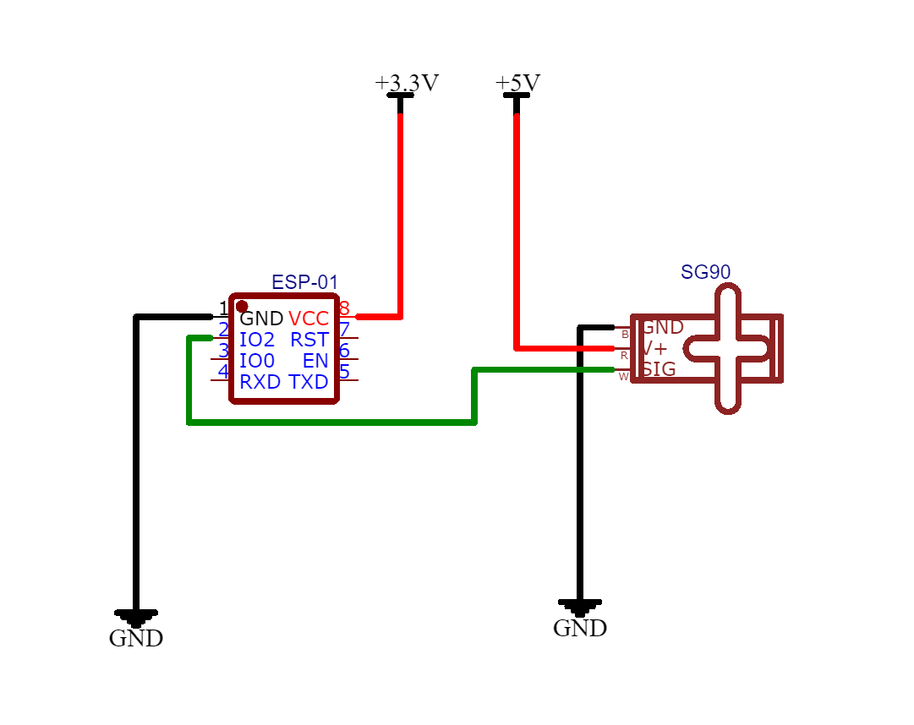

# ESP8266 RTOS SyncdServo

In this project the data read from a 6 axis motion sensor was used to guide a small servo motor. The goal was to replicate the angle measured by the sensor on the small arm attached to the servo. The servo and the sensor were attached to two different micro-controllers, the micro-controllers communicated through a wireless protocol.
I went into this project full aware of its limitations, the most important being the unreliability of the position data calculated only using 3DOF acceleration and 3DOF gyroscope sensors. Under this aspect the MPU6050, after being properly tuned, proved to be a very good sensor and the drift in the data, while always present, was partialy mitigated.

## List of components

#### Sender:
- ESP8266-01
- MPU6050 attitude sensor
- 2x 4.7k ohm pull-up resistors
#### Receiver:
- ESP8266-01
- SG90 servo motor
- breadboard power module

## Small Description

For the communication between the two micro-controllers the ESPNOW protocol was chosen mainly for two reasons: First, the small amount of data that needed to be sent and received each time and second the uncentralized nature of the project.
This project was developed using the ESP RTOS SDK and no external MPU6050 related library was used to communicate with the MPU6050, it was also chosen not to use the MPU DMP and instead compute the necessary data directly in the code.

## Usage and Requirements

This project requires the [ESP RTOS v3.3].  
Get the proper [Toolchain], the [ESP RTOS] and set up the [Path] for the toolchain.  
Use `make app` to compile the code and `make app flash` to flash it into the ESP-01.

## Sender Schematics

## Receiver Schematics

[ESP RTOS v3.3]: <https://github.com/espressif/ESP8266_RTOS_SDK/tree/release/v3.3#get-toolchain>
[Toolchain]: <https://github.com/espressif/ESP8266_RTOS_SDK/tree/release/v3.3#get-toolchain>
[ESP RTOS]: <https://github.com/espressif/ESP8266_RTOS_SDK/tree/release/v3.3#get-esp8266_rtos_sdk>
[Path]: <https://github.com/espressif/ESP8266_RTOS_SDK/tree/release/v3.3#setup-path-to-esp8266_rtos_sdk>

